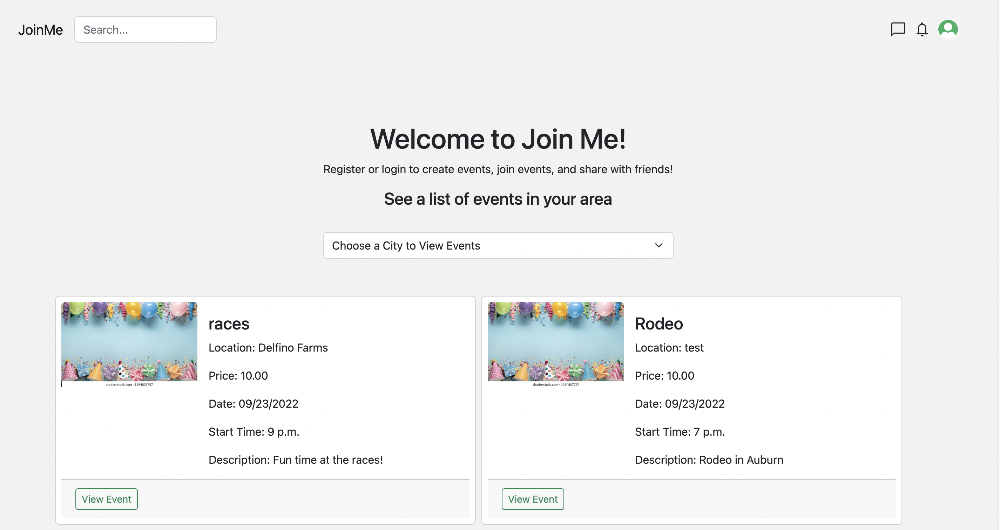
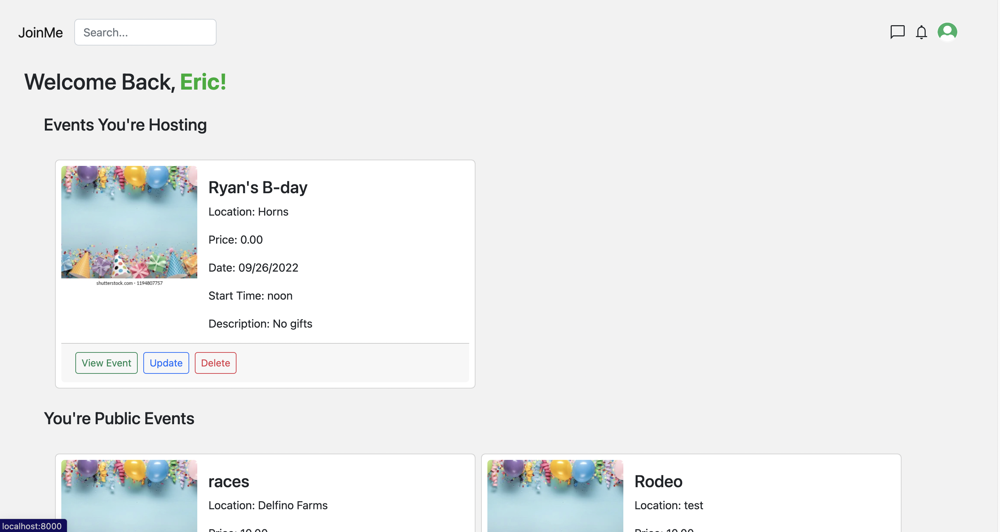

# joinMe
>An event app designed so you never miss a great time.

## Table of Contents

* [Info](#info)
* [Project Demo](#project-demo)
* [Project Video](#project-video)
* [Technologies](#technologies)
* [Features](#features)
* [Status](#status)
* [Inspiration](#inspiration)
* [Contact](#contact)

## Info
Join me is an easy to use web application designed to allow users to creat events, join events, and share events with friends.

Is It Burnt

 

</kbd>
<kbd>

</kbd>

## Project Demo

Deployment Coming Soon

## Project Video

Project Video Coming Soon

## Technologies
### Frontend
* HTML
* CSS
* Bootstrap
* Javascript

### Backend
* Django
* Python
* Bcrypt
* PostgreSQL Database
* Psycopg2
* Pillow

## Features
* Authorization and authnetication inplemented with Django and bcrypt
* Django admin pannel
* Django forms for creating events and users
* Users can create accounts though the applicaiton
* Users can create, view, edit, and delete events

## Features in progress
* Users can add friends and create private and group chats
* Users can like and view liked events on their dashboard
* User account page with the ability to change and update user info and passwords
* Addition of google maps to view event locaitons 

## Status

Join me is in progress with the above features being added currently 

## Inspiration

My family and I love to attend events in our area. I found it difficult to search the many differnt City, County, and venue websites to see the events and their info. Join me will bring all those events to one place for easy viewing. 

## Contact
Created by [Eric Horn](www.linkedin.com/in/eric-horn-60143454)
Contact me with any questions